## Documentation by Matthew was inclded in a google doc and this was used to feed much of the documentation below such as user stories .
## DOCUMENTATION BY Paul created the read me and set up the initial structure 
# Dish Discovery Project

# Dish Discoery

Dish Discovery is a recipe collection that aims to provide new and exciting meals and recipes to its users so they can become more proficient in becoming a master chief in their kitchen. Dish Discovery is targeted towards the Average Home-Cook who is looking to try new recipes and meals to enhance their skills in the kitchen. Dish Discovery is a valuable resource to those who want to enhance and expand their palette as Dish Discovery has various recipes from different cultures and countries from around the world which empowers our users to experiment with new flavours.

# Responsive Mockup

------------------**NOTE FOR TEAM** these links will update automatically as we push merges. They should show the current live finished version of the site once we are ready to present-----------------------------------

[Contact Page](https://ui.dev/amiresponsive?url=https://beardyone80.github.io/Home-Cook-Hackathon-2/contact-us.html)
[Home Page](https://ui.dev/amiresponsive?url=https://beardyone80.github.io/Home-Cook-Hackathon-2/index.html)
[About Us](https://ui.dev/amiresponsive?url=https://beardyone80.github.io/Home-Cook-Hackathon-2/about-us.html)
[Logged in page](https://beardyone80.github.io/Home-Cook-Hackathon-2/login-index.html)
[Sign Up Page](https://beardyone80.github.io/Home-Cook-Hackathon-2/sign-up.html)

## Features 

Through discussion and the use of a persona and user stories we determined a number of features and assigned importance and an estimated difficulty to each one. From this process we were able to implement the following features:

### Existing Features
**#01 AS A HOME CHEF**
- **I WANT** to make quick meals for my family after school and work.
- **SO THAT** I can feed my family tasty and nutritious food.

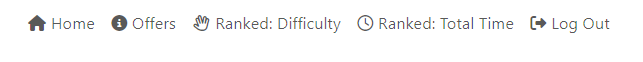

-The navbar allows user to organise the recipe cards by time taken . 

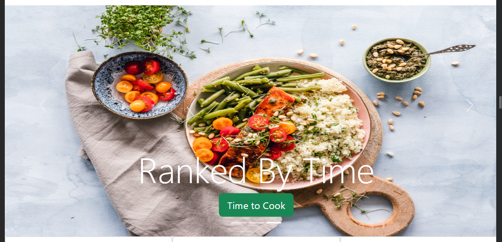
-The carousel allows user to select option ranked by time by clicking button this will take them to the time.html file. 

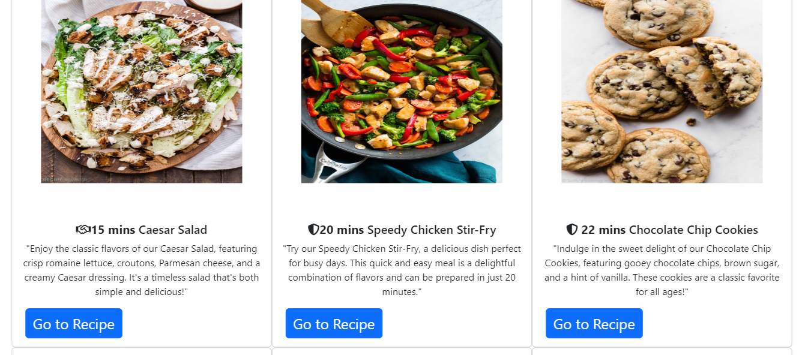

-In the time.html file all stories are organised from shortest to longest time . These are also given the total cooking time within the button that links them to the recipe page. 

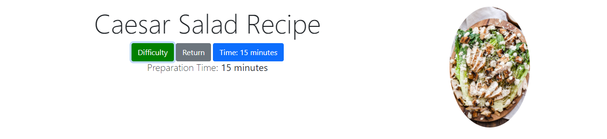

- After clicking to the recipe page the Time is displayed in a button as well as in plain text below that spilts it into a preparation and cooking time.

**#02 AS A HOME CHEF**
- **I WANT** some new ideas for meals as I am always cooking the same things.
- **SO THAT** I can try out new foods and get some excitement into mealtimes.
*(random recommendations for new meals? Or section with ideas for meals? )*

-There are 20 diverse recipes to pick from across a range of cultures, skills , cooking times and taste preferences

**#03 AS A HOME CHEF**
- **I WANT** to know how difficult something is to cook.
- **SO THAT** I can improve my cooking skill and cook at a similar level.
*(relates to difficulty)*

-Navbar and carousel same as before allows users to pick difficulty with similar functionality to the time see above for the time . The only variation is starting with the hardest and going to the easiest as the same is improving cooking skill.

**#04 AS A HOME CHEF**
- **I WANT** to expand my palate and try new meals and recipes from different cultures.
- **SO THAT** I can find new favorite meals.
*(relates to categories, requires additional categories for other countries, Mexican, etc.)*

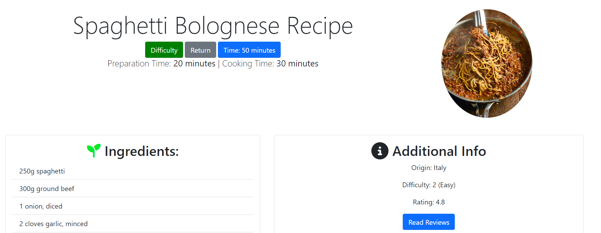
-All recipes have a built in origin description and chosen from a range of cultural cooking styles . Feel free to scroll the recipe file to confirm this. 

**#05 AS A HOME CHEF**
- **I WANT** to know how long a meal takes to cook.
- **SO THAT** I know how much time I will be spending cooking.
*(relates to the cooking time feature icon with text)*

- By the image you can see that their is an option in carousel to arrange by time 
- Recipes were chosen with a focus lower cooking times besides a few.
- This selection option is also available in the Navbar

**#06 AS A HOME CHEF**
- **I WANT** to be able to have my recipes on my phone/tablet in the kitchen with me.
- **SO THAT** I can prop it up and follow the recipe without printing out instructions.
*(relates to the responsiveness of the website)*

-This user story is still a work in progress and can be seen in the error document . Most pages respond well to variations in screen sizes see below . 

**#07 AS A HOME CHEF**
- **I WANT** to have a login profile and create an account.
- **SO THAT** I can save and bookmark visited recipes and meals to look at later.

-Book marking recipes is for the next sprint 
-We have created a fake login scenario so that we can show what would happen if we were to login. This opens the secondary  navbar and unvails the options to select the different recipes.

**#08 AS A HOME CHEF**
- **I WANT** to find the most popular meals to save time looking around for a meal.
- **SO THAT** I can cook meals that reviews are positive, so I know that it is a quality meal.

-In the sort by user reviews section which is the basis for the logged in page the menu tickets are ordered by user ratings. 
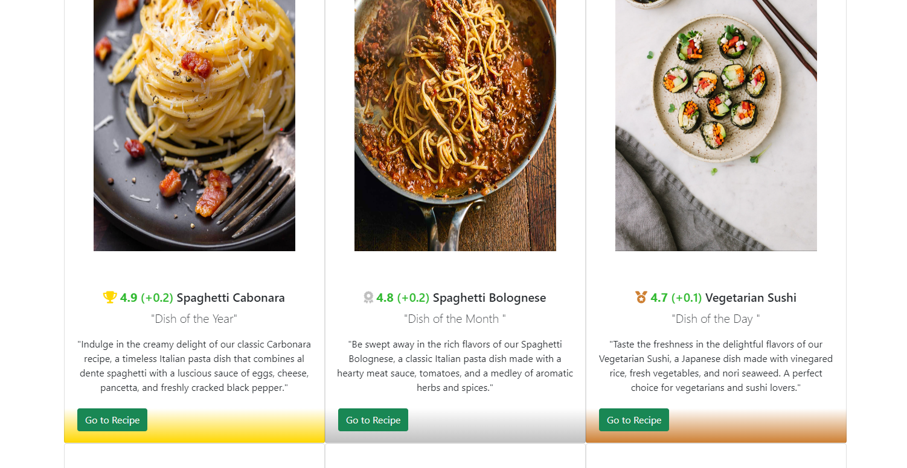

**#09 AS A HOME CHEF**
- **I WANT** to have varied recipe pages.
- **SO THAT** I can look for inspiration to cook a delicious meal with a busy schedule.
- Recipes are varied from lamb burgers to tiramasu it all depends on your cooking skill requirments and time restraints 
- __Landing Page__

  - The landing page features a header hero image with a clear enticing tagline and a button located directly below that will lead the user directly to the sign up page -which will work in the next sprint 
  - Below this is a carousel slider featuring captions that will relate to the user as defined by our user stories and persona. A button is featured again along with a tagline calling out the special discounted sign up offer. This button will lead directly to the sign up page again and is repeated on each slide of the carousel.
  
  
  - A call to action is displayed on small screen media instead of the carousel. This includes a caption again directing the user to sign up with the special offer incentive also displayed.

  

- __About Us Section__

  - This page contains our company ethos and values. It gives the user a clear and emphatic vision of the meals and recipes we are excited to present to them.
  - It includes a striking colour band containing a strong tagline to evoke passion and desire in the user and creative formatting to appeal to the user, the 'YOU' in the text so they can relate and identify and be keen to further engage with us.

- __Contact Us Page__

  - A clear easy to navigate contact us page has been implemented which gives the user further information inside an accordion style FAQ section as well as an enquiry form for any questions. Email addresses and a telephone number are also present so that the user will feel fully confident that we are a responsive and attentive company.

- __Logged in Home Page__ 
-Reused hero image . 
-Carousel with the option to shift from user review ratings to difficulty and time taken .
-Features the recipes on cards with easy access to the recipe links by clicking on a button.
-Features demo images of what the recipes will look like.

## Testing 

-Please see the second working  read.me 

### Validator Testing 

Matthew Smith- 

I have validated the recipe-file.html through using W3C validator to resolve errors within the code. There were warnings that the validator has identified however, these relate to the bootstrap classess. 

- HTML
  - No errors were returned when passing through the official [W3C validator](https://validator.w3.org/nu/?doc=https%3A%2F%2Fcode-institute-org.github.io%2Flove-running-2.0%2Findex.html)
- CSS
  - No errors were found when passing through the official [(Jigsaw) validator](https://jigsaw.w3.org/css-validator/validator?uri=https%3A%2F%2Fvalidator.w3.org%2Fnu%2F%3Fdoc%3Dhttps%253A%252F%252Fcode-institute-org.github.io%252Flove-running-2.0%252Findex.html&profile=css3svg&usermedium=all&warning=1&vextwarning=&lang=en#css)

### Unfixed Bugs

You will need to mention unfixed bugs and why they were not fixed. This section should include shortcomings of the frameworks or technologies used. Although time can be a big variable to consider, paucity of time and difficulty understanding implementation is not a valid reason to leave bugs unfixed. 

## Deployment

This section should describe the process you went through to deploy the project to a hosting platform (e.g. GitHub) 

- The site was deployed to GitHub pages. The steps to deploy are as follows: 
  - In the GitHub repository, navigate to the Settings tab 
  - From the source section drop-down menu, select the Master Branch
  - Once the master branch has been selected, the page will be automatically refreshed with a detailed ribbon display to indicate the successful deployment. 

The live link can be found here - https://code-institute-org.github.io/love-running-2.0/index.html 

## Credits 

In this section you need to reference where you got your content, media and extra help from. It is common practice to use code from other repositories and tutorials, however, it is important to be very specific about these sources to avoid plagiarism. 

You can break the credits section up into Content and Media, depending on what you have included in your project. 

### Content 

- The text for the Home page was taken from Wikipedia Article A
- Instructions on how to implement form validation on the Sign Up page was taken from [Specific YouTube Tutorial](https://www.youtube.com/)
- The icons in the footer were taken from [Font Awesome](https://fontawesome.com/)

### Media

- The photos used on the home and sign up page are from This Open Source site
- The images used for the gallery page were taken from this other open source site

Congratulations on completing your Readme, you have made another big stride in the direction of being a developer! 

## Other General Project Advice

Below you will find a couple of extra tips that may be helpful when completing your project. Remember that each of these projects will become part of your final portfolio so it’s important to allow enough time to showcase your best work! 

- One of the most basic elements of keeping a healthy commit history is with the commit message. When getting started with your project, read through [this article](https://chris.beams.io/posts/git-commit/) by Chris Beams on How to Write  a Git Commit Message 
  - Make sure to keep the messages in the imperative mood 

- When naming the files in your project directory, make sure to consider meaningful naming of files, point to specific names and sections of content.
  - For example, instead of naming an image used ‘image1.png’ consider naming it ‘landing_page_img.png’. This will ensure that there are clear file paths kept. 

- Do some extra research on good and bad coding practices, there are a handful of useful articles to read, consider reviewing the following list when getting started:
  - [Writing Your Best Code](https://learn.shayhowe.com/html-css/writing-your-best-code/)
  - [HTML & CSS Coding Best Practices](https://medium.com/@inceptiondj.info/html-css-coding-best-practice-fadb9870a00f)
  - [Google HTML/CSS Style Guide](https://google.github.io/styleguide/htmlcssguide.html#General)

## DOCUMENTATION BY JESSE ROSS

## Day 1: Hackathon

### Project Name: Dish Discovery

#### Roles:

| Role             | Day 1     | Day 2     | Day 3     |
| ---------------- | --------- | --------- | --------- |
| Project Manager  | Stacey    | Jesse     | Stacey    |
| Lead Dev         | Jesse     | Stacey    | Matthew   |
| UX               | Paul      | Matthew   | Paul      |
| Documents        | Matthew   | Paul      | Jesse     |

### Idea 2: Recipe Collection

**Personas:**

1. **Busy Professional**
   - Age: 25-40
   - Occupation: Corporate job
   - Needs: Find quick and easy recipes for weeknight dinners
   - Goals: Cook healthy meals in a limited amount of time

   *Reasoning for busy professional:*
   It is a very restrictive option, limiting creativity, restrictive with time limit, and complexity of meals as busy individuals may not want to cook complicated dishes.

2. **Home Chef**
   - Age: 30-50
   - Occupation: Homemaker or food enthusiast
   - Needs: Find a variety of recipes to expand culinary skills
   - Goals: Impress family and friends with new dishes

   *Reasoning for Home Chef:*
   Versatile. Project team connects with the persona. Caters to a broader audience.

3. **Diet-Conscious Individual**
   - Age: 20-35
   - Occupation: Health or fitness professional
   - Needs: Find recipes that align with specific dietary restrictions or goals
   - Goals: Maintain a balanced and healthy diet

   *Reasoning:*
   More effort with research. There is a huge time sink in researching diets and dieting methods. Does not cater to a large user audience.

**Brief: Emily**

Emily is a passionate home chef who loves experimenting in the kitchen. She is constantly looking for new and unique recipes to expand her culinary skills. Cooking is not just a hobby for her but a way to connect with her loved ones and create meaningful experiences.

**Problem:**

*Your Persona struggles from this issue*

Emily struggles with finding a variety of recipes that align with her taste preferences and dietary restrictions. She often spends too much time searching and sifting through countless recipe websites and cookbooks, feeling overwhelmed and uninspired.

**Goal:**

*Your Persona wants to achieve this transformation*

Emily's ultimate goal is to impress her family and friends with new and exciting dishes. She wants to become a master chef in her own kitchen and create memorable dining experiences for her loved ones.

**General User's Goal:**

Users want to find new recipes to try, with clear instructions and ingredient lists.

**Site Owner's Goal:**

The site’s goal is to provide a collection of enjoyable, easy-to-follow recipes, develop a larger user base, and create advertising revenue. Create links and business relationships with companies like Hello Fresh.

**Potential Features to Include:**

- **Categorization of recipes:** Allow users to browse recipes by meal type, cuisine, or dietary restrictions.
- **Individual recipe pages:** Detailed pages for each recipe, including ingredient lists, step-by-step instructions, preparation/cooking time, and high-quality images.
- **Responsive design:** Ensure the website is accessible and user-friendly on all devices.
- **User ratings and reviews:** Allow users to leave reviews for each recipe.
- **Shopping list generator:** Allow users to create a shopping list based on the selected recipes.
- **Cooking timer:** Add a built-in timer to each recipe page to increase cooking accuracy.
- **Create an account to save favorite recipes.**
- **Difficulty Score for cooking.**
- **Follow-along videos - how to cook the meal (mini cookery show style?).**

#### Features:

| Features             | Complexity (1-5) | Usefulness (1-5) |
| ----------------------|-------------------|-------------------|
| Categories           | 2                 | 4                 |
| Recipe Pages         | 3                 | 5                 |
| Responsive Design    | 4                 | 5                 |
| Shopping List        | 5                 | 3                 |
| User Ratings         | 1                 | 3                 |
| Create an Account    | 3                 | 4                 |
| Cooking Time         | 1                 | 4                 |
| Difficulty Score     | 1                 | 4                 |
| Cook Along Videos    | 4                 | 5                 |

*Removed due to time constraints:*
- Shopping list - not fully able to create it without JavaScript, out of scope of hackathon.
- Cook Along videos - issue with finding royalty-free videos.

### User Stories

**#01 AS A HOME CHEF**
- **I WANT** to make quick meals for my family after school and work.
- **SO THAT** I can feed my family tasty and nutritious food.
*(relates to categories and mealtime and difficulty, requires an additional section to add nutritional information)*

**#02 AS A HOME CHEF**
- **I WANT** some new ideas for meals as I am always cooking the same things.
- **SO THAT** I can try out new foods and get some excitement into mealtimes.
*(random recommendations for new meals? Or section with ideas for meals? )*

**#03 AS A HOME CHEF**
- **I WANT** to know how difficult something is to cook.
- **SO THAT** I can improve my cooking skill and cook at a similar level.
*(relates to difficulty)*

**#04 AS A HOME CHEF**
- **I WANT** to expand my palate and try new meals and recipes from different cultures.
- **SO THAT** I can find new favorite meals.
*(relates to categories, requires additional categories for other countries, Mexican, etc.)*

**#05 AS A HOME CHEF**
- **I WANT** to know how long a meal takes to cook.
- **SO THAT** I know how much time I will be spending cooking.
*(relates to the cooking time feature icon with text)*

**#06 AS A HOME CHEF**
- **I WANT** to be able to have my recipes on my phone/tablet in the kitchen with me.
- **SO THAT** I can prop it up and follow the recipe without printing out instructions.
*(relates to the responsiveness of the website)*

**#07 AS A HOME CHEF**
- **I WANT** to have a login profile and create an account.
- **SO THAT** I can save and bookmark visited recipes and meals to look at later.

**#08 AS A HOME CHEF**
- **I WANT** to find the most popular meals to save time looking around for a meal.
- **SO THAT** I can cook meals that reviews are positive, so I know that it is a quality meal.

**#09 AS A HOME CHEF**
- **I WANT** to have varied recipe pages.
- **SO THAT** I can look for inspiration to cook a delicious meal with a busy schedule.

**Unique Selling Points:**
- User Reviews of the Recipe
- Discover diverse and exciting meal ideas from different cuisines for your family
- Easily gauge the cooking difficulty level to match your skill and improve gradually, with the ability to keep track of previously used recipes
- Explore global cuisines and find new favorite dishes to enjoy.
- Accurately estimate cooking time for efficient meal planning.
- Conveniently access and follow recipes on your phone or tablet in the kitchen.
- Increase mealtime excitement with quick, nutritious, and delicious family dinners.

**Acceptance Criteria:**
- Be responsive to different devices.
- High-quality images - at the top of recipes
- Clear and concise instructions - list of steps
- Working Login Page - functioning form
- Searchable recipe database (categorized) - search box
- User ratings attached to each recipe - displayed as an icon
- Variety of different recipes - sourced through a filter system
- Picture of food (end product), step-by-step instructions, and ingredients list for each recipe - this could be displayed as cards
- Times on each recipe - displayed with an icon and a time
- Positive user reviews - should be displayed as icons
- Culturally inclusive recipes - displayed as cards - that are linked
- Functioning navbar and footer - all linked
- Ingredients list functionality - link to online grocery stores (**nice to have if time**)

**Target Audience:**
- Anyone that cooks from home.
- Single moms
- Students
- Working-class with a tight budget
- Anyone interested in nutritious food
- Restaurant Cafe owners who want to get some ideas
- New Cooks
- Health-conscious home cooks

**Unused User Stories:**
*(These user stories were not used in the project due to time constraints or scope considerations.)*

**#05 AS A HOME CHEF**
- **I WANT** to be able to cook for specific dietary requirements
- **SO THAT** I can cater for everyone.

**#06 AS A HOME CHEF**
- **I WANT** to learn how to make more complex dishes
- **SO THAT** I can invite friends and family over for dinner parties and impress them.

**#10 AS A HOME CHEF**
- **I WANT** to keep a cupboard full of handy commonly used ingredients/spices to help with my cooking
- **SO THAT** I don't have to keep going to the shop every time I try a new recipe.
*(Good idea but limited by time constraints of three days)*

**#08 AS A HOME CHEF**
- **I WANT** I would like to be able to select meals from different cuisines
- **SO THAT** I can cater to different tastes.

## Table of Contents
- [Wireframing](#wireframing)
- [Coding Philosophy](#coding-philosophy)
- [Progress for Day One](#progress-for-day-one)
- [Individual Contributions](#individual-contributions)

## Wireframing

### Visitor
- Navbar with 'About,' 'Contact Us,' and 'Login' links.
- Paul's slider carousel to give a taste of what you can expect.
- A brief introduction about the company.
- Footer with social media links.

## Coding Philosophy

- Only one person works on one page at a time.
- Utilize Bootstrap styling for consistency.
- Prioritize structure and functionality in your code.
- Use the project board to track tasks and progress.
- Do not make changes to other people's branches.
- Follow the established push procedure to maintain code integrity.

-**Progress for Day One**

- Wireframed the initial design of the website.
- Worked on the design of the website and added the basic structure and components (navigation menu, footer, HTML boilerplate).

## Table of Contents
- [Wireframing](#wireframing)
- [Coding Philosophy](#coding-philosophy)
- [Progress for Day One](#progress-for-day-one)
- [Progress for Day Two](#progress-for-day-two)
- [Individual Contributions](#individual-contributions)

## Wireframing

##Paul  Homepage Rough Logged in Rough 
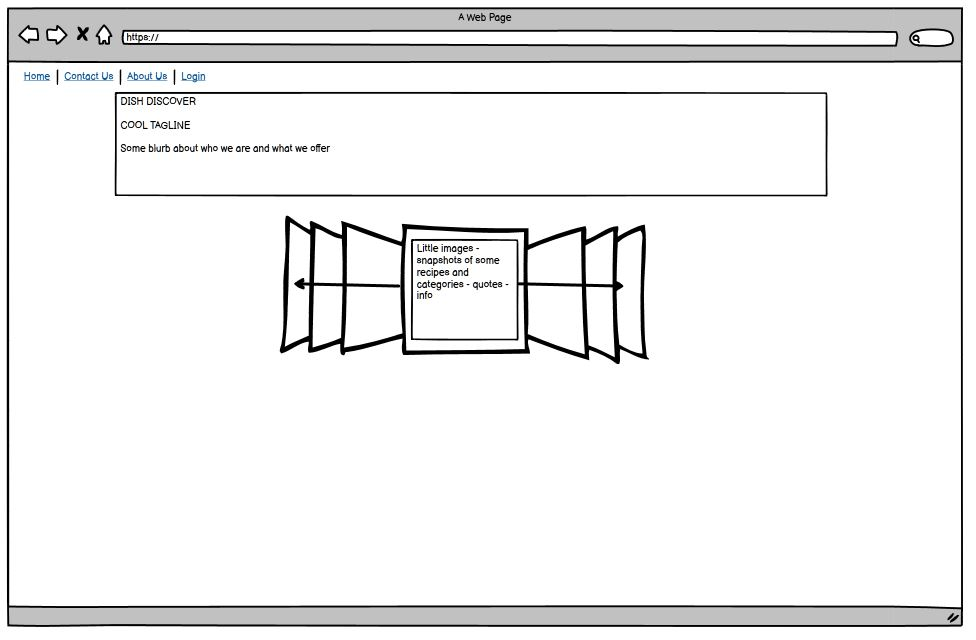

## Matthew  Contats Us Page 
.JPG)

##Stacey Contact Us  
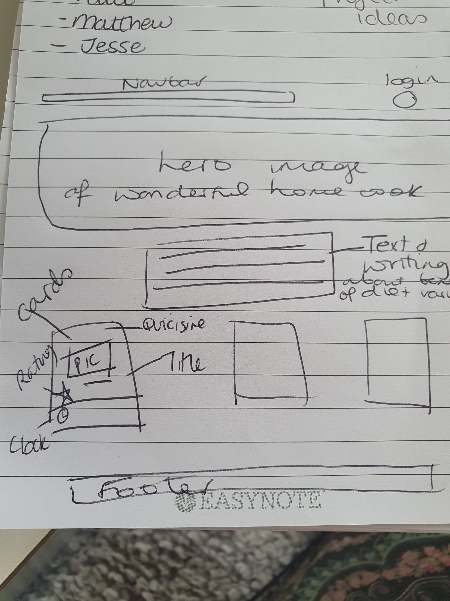

## Jesse Ross
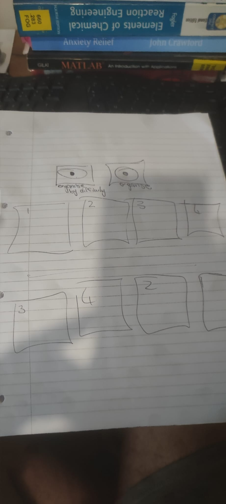
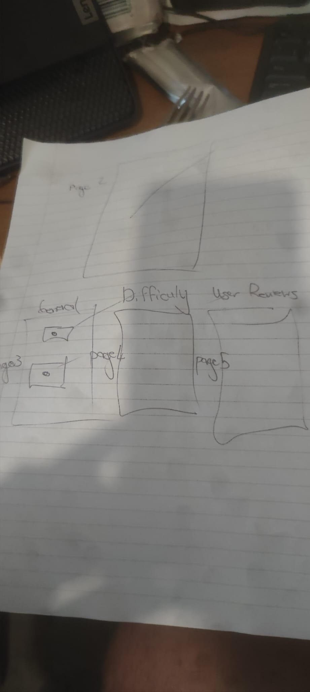
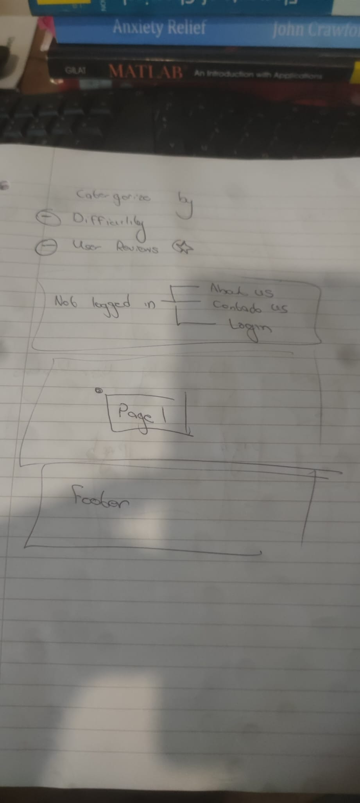

### Visitor
- Navbar with 'About,' 'Contact Us,' and 'Login' links.
- Paul's slider carousel to give a taste of what you can expect.
- A brief introduction about the company.
- Footer with social media links.

### Logged In 
-Update navbar with "organise by user rating, difficulty and time to cook. 
-Re use most of structure from visitor login 
- Establish a recipe file that links in an out with the organisation files 
-Focus on the layout of cards and invidiual recipes .

## Coding Philosophy

- Only one person works on one page at a time.
- Utilize Bootstrap styling for consistency.
- Prioritize structure and functionality in your code.
- Use the project board to track tasks and progress.
- Do not make changes to other people's branches.
- Follow the established push procedure to maintain code integrity.
- Wireframed the initial design of the website.

## Individual Contributions

### Jesse

- Role: Lead Dev.
- Organized workloads and managed project progression.
- Troubleshot technical issues.
- Established a robust repository structure and project board.
- Ensured organized development and future scalability.
- Crafted the core file structure.
- Designed the header and footer for a seamless user experience.
- Created an intuitive and aesthetically pleasing navbar.
- Played a vital role in troubleshooting, branch mergers, and codebase maintenance.
- Set up the initial page for the logged-in version.

### Paul
- Responsible for UX.
- Created a wireframe for the site design.
- Started work on the main home page for non-logged-in visitors.
- Added a carousel to the page.
- Began work on the "logged in" home page using the wireframe for reference.

### Stacey
- Worked on parts of the 'About Us' page, including a hero image and text.

### Matthew
- Responsible for Documentation.
- Created the sign-up page with a form.
- Developed the contact page with a hero image, accordion, and form.
- Ensured detailed documentation of the process and actions of the website.

## Progress for Day Two

- **Project Manager: Jesse Ross**
  - Added navigation throughout the site.
  - Added all the recipe cards to each page.
  - Completed the time, difficulty, and login index pages.
  - Completed the header and footer to a great standard.
  - Completed the recipe files.
  - Handled all user tickets besides sign up.
  - Recipe files and time , difficulty + login were reverted to previous versions due to merge error

- **Lead Dev: Stacey** 
- I compiled all of the code, tidied up, and organized them into one file.
- I copied over the code into the main repository and ensured each page had the correct navbar and footer along with the hero image.

-**Documentation:Paul**

- Worked on index.html and styled the carousel.
- Fixed responsiveness issues.
- Added a call-to-action (CTA) for small screen sizes.
- Enhanced readability by adding blur and drop shadows to some captions.
- Ensured that the footer and header were aligned with the rest of the site.

-**UX:Matthew**
- Changed the styling on the "Contact Us" page to a lighter blue.
- Worked on the recipe page to add a slider and a flush group for ingredients.
- Identified areas for improvement with responsiveness and took action to enhance it.
- Made improvements to the navigation bar for better user experience.

**Note:** Paul had to create a new repository as these efforts resulted in a merge error. 

## Progress for Day Three ##

**Project-Manager:Matthew**

- Sorted out layout of building block recipe pages. 
-Ensured validation.
- Adding FontAwesome titles. 
- Final group testing monitoring . 
- Review documentation and presentation . 
**Lead Dev:Paul** 

- Monitored and controlled all pull requests to ensure code quality and consistency.
- Sorted out image errors in the "Contact Us" section for a better user experience.
- Delegated workload effectively among team members to maximize productivity.
 -Conducted site-wide testing to identify and fix any issues
-Reviewed and corrected relative pathnames where needed for proper functionality.

**Documentation:Jesse Ross**

- Uploaded images to the README for better documentation.
- Sorted out project boards, added missing information, and updated existing details.
- Fixed footer consistency across all pages for a unified look.
- Added a carousel for convenient navigation options.
- Corrected merge errors from the previous day to maintain code integrity.
- Styled the difficulty index for both logged-in and logged-out states.
- Planned to complete validation for improved user experience.
- A lot of the documentation was left until the last minute therefore the objectives of the documentation page and testing were not met. 

**UX:Stacey**
- Working on presentaiton for users .
- Monitoring experence of users on our site. 

**Final remarks** 
- Live user testing was done in the third day indentifying a load of issues to be seen in the second read me file documented by Paul's found errors . As well as 2 live user testers.  Template writing unfilled is due to the lack of documentation throughout the projects journey. Validation is added with to the validators form. Final pushes done without group consensus
  

