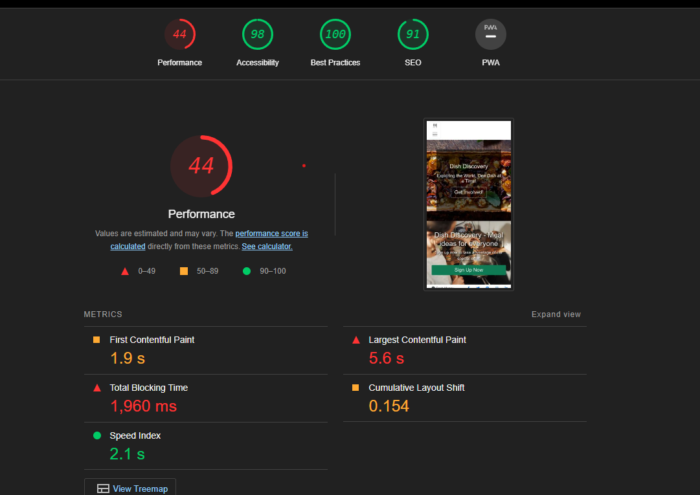
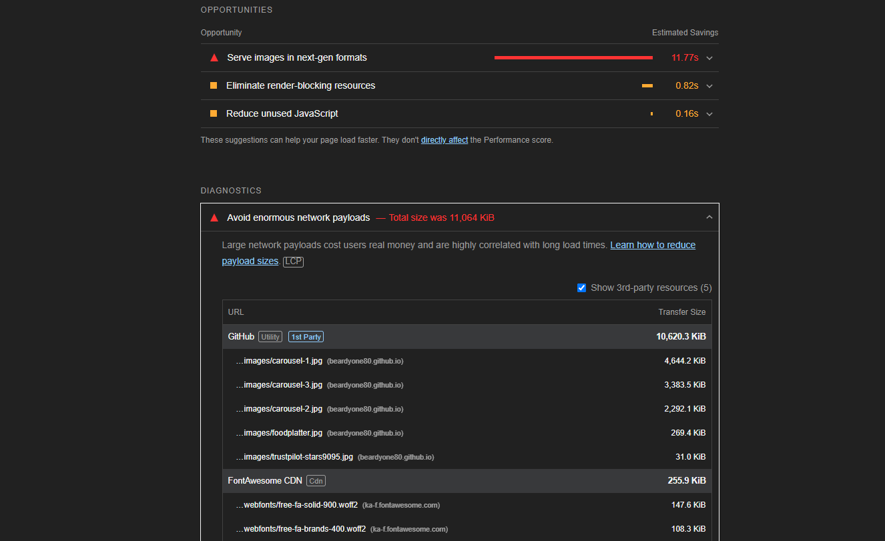

##Validation ##
**W3C** 
-Matthew  I have validated the Recipe-file.html through using W3C to resolve Errors. There were warnings related to bootstrap classes and formatting. The name elements attached to the anchor elements are essential in the navigation of the website.

**Lighthouse**

- Lighthouse indicates a high score for accessbility and best practices. However the performance score is low 

-The performance analysis indicates that in the second sprint . The carousel should be removed immediately . This is not a big fix and shall be done shortly in the second sprint. 
-It is the understanding of this group that front page loading is very serious. 
**Jigsaw3** 
- Jigsaw states 1 error and 256  
The error is not related to anything other than bootstrap 

